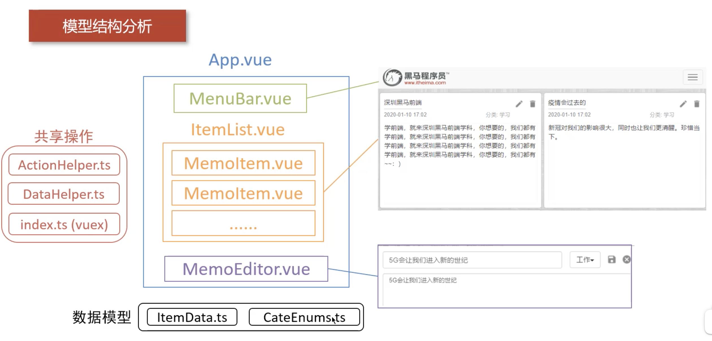

# 模型分析

通过组件的方式组合页面

+ `App.vue`: 入口文件

+ **Components**: 组件
    + `MemuBar.vue`: 菜单栏
    + `ItemList.vue`: 列表框， 管理所有 memo 卡
    + `MemoItem.vue`: memo 卡
    + `MemoEditor.vue`: memo 卡编辑器

+ **store**: vuex 传递数据
    + `ActionHelper.ts`: memo 操作 datahelper
    + `DataHelper.ts`: 操作 localStorage， 存取数据
    + `index.ts`(vuex): 共享数据，传递数据

+ **数据模型**:
    + `ItemData.ts`: memo 数据结构
    + `CataEnums.ts`: 分类的枚举类型