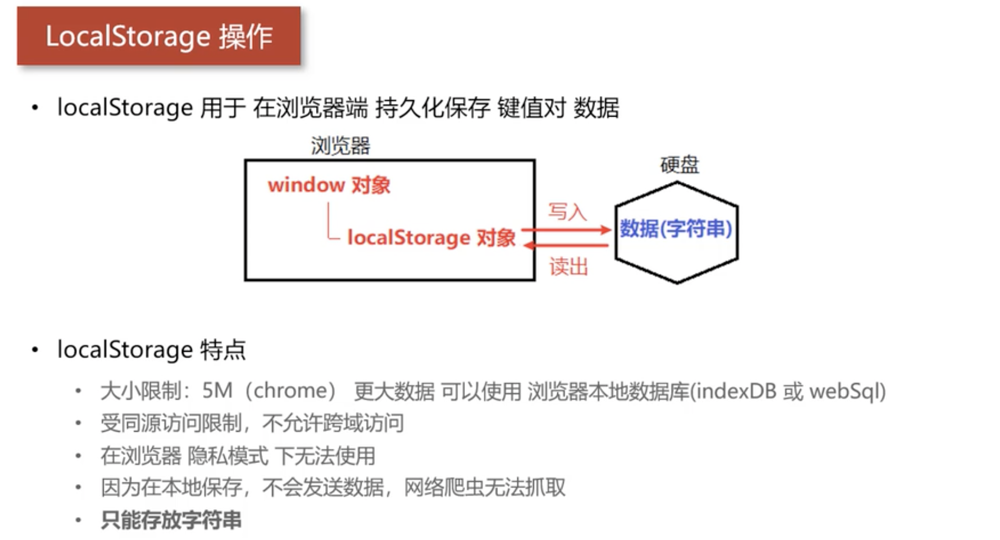

# datahelper

数据交互层。 用于对接管理 数据库 等


## localStorage




| 方法签名 | 用途 |
| -- | -- |
| `localStorage.setItem('key','value')` | 保存数据 |
| `localStorage.getItem('key')` | 根据 key 读取数据 |
| `localStorage.removeItem('key')` | 根据 key 删除数据 |
| `localStorage.clear()` | 清空所有 |


1. localStorage 只能保存字符串， 因此在保存数据时需要将其做对应的转换(序列化)

```ts
// 1. 转换字符串
let strJson: string = JSON.stringify(对象)

// 2. 保存
localStorage.setItem('key',strJson)
```

2. 读取时候就翻着来， 先读字符串，再反序列化。 

> 注意: `localStorage` 为找到结果时，返回 `null`， 需要进行处理

```ts
let strJson: string|null = localStorage.getItem('key')

// 2. 先做类型断言 `strJson as string`
//    在做反序列化
let obj=JSON.parse(strJson as string)
```

